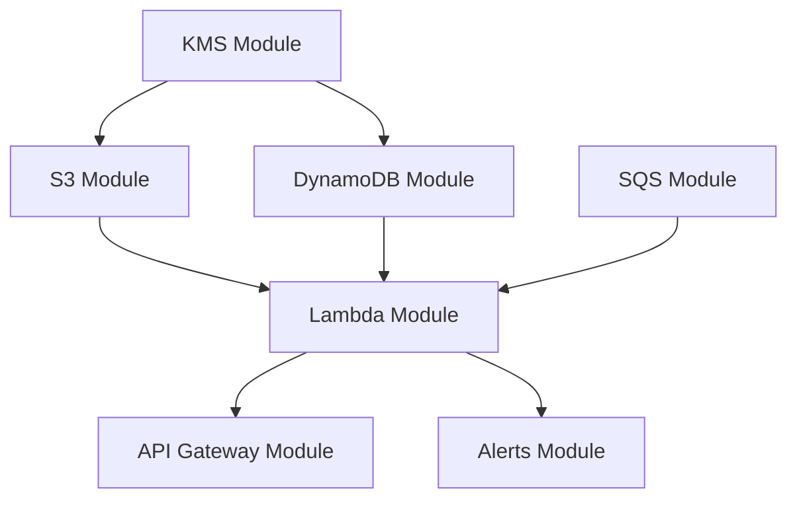

# Terraform Modules Documentation

## Module Structure

All Terraform modules follow a consistent structure:

```
infrastructure/modules/<module-name>/
├── main.tf          # Resource definitions
├── variables.tf     # Input variables
├── outputs.tf       # Output values
├── README.md        # Module documentation
└── versions.tf      # Provider version constraints (optional)
```

## Existing Modules

### S3 Module
- **Path**: `infrastructure/modules/s3/`
- **Purpose**: S3 bucket creation with encryption and lifecycle policies
- **Key Resources**:
  - S3 buckets (temp and final)
  - Bucket policies
  - Lifecycle rules
  - Encryption configuration
- **Inputs**: See `variables.tf`
- **Outputs**: Bucket ARNs, names
- **Documentation**: `infrastructure/modules/s3/README.md`

### [TODO: Document other modules as they are created]

## Module Composition Pattern

The root `infrastructure/main.tf` composes modules:

```hcl
module "s3_temp" {
  source = "./modules/s3"
  # ... configuration
}

module "s3_final" {
  source = "./modules/s3"
  # ... configuration
}

module "dynamodb" {
  source = "./modules/dynamodb"
  # ... configuration
}

# etc.
```

## Module Guidelines

### Inputs (variables.tf)
- Use descriptive variable names
- Provide default values where sensible
- Include validation rules
- Add descriptions for all variables

### Outputs (outputs.tf)
- Export ARNs for resources that need cross-module references
- Export names/IDs for dependent resources
- Include descriptions

### Documentation (README.md)
Each module README must include:
- Purpose and scope
- Architecture diagram (if complex)
- Input variable table
- Output value table
- Usage examples
- Dependencies

## Module Dependencies



## Verification

### Module Completeness Check
```bash
# Each module should have these files
for module in infrastructure/modules/*/; do
  echo "Checking $module"
  [ -f "$module/main.tf" ] && echo "✓ main.tf" || echo "✗ main.tf"
  [ -f "$module/variables.tf" ] && echo "✓ variables.tf" || echo "✗ variables.tf"
  [ -f "$module/outputs.tf" ] && echo "✓ outputs.tf" || echo "✗ outputs.tf"
  [ -f "$module/README.md" ] && echo "✓ README.md" || echo "✗ README.md"
done
```

### No Resources in Root
```bash
# Root main.tf should only contain module blocks and data sources
# No 'resource' blocks allowed
cd infrastructure && grep -n '^resource ' main.tf && echo "FAIL: Resources found in root" || echo "PASS: Root only uses modules"
```

## Last Updated
[TODO: Update when modules change]
