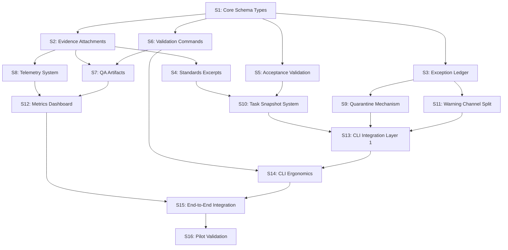

# Task Context Cache Hardening: Implementation Sessions

**Status**: Implementation Roadmap
**Parent Proposal**: `docs/proposals/task-context-cache-hardening.md`
**Schemas Reference**: `docs/proposals/task-context-cache-hardening-schemas.md`
**Date**: 2025-11-17
**Purpose**: Break down hardening implementation into independently testable LLM sessions with parallelization opportunities

---

## Table of Contents

1. [Session Dependency Graph](#session-dependency-graph)
2. [Session Definitions](#session-definitions)
3. [Parallel Execution Plan](#parallel-execution-plan)
4. [Session Testing Requirements](#session-testing-requirements)
5. [Success Criteria](#success-criteria)

---

## Session Dependency Graph



**Parallelization Opportunities** (sessions with no dependencies between them):
- **Wave 1**: S1 (foundation - must complete first)
- **Wave 2**: S2, S3, S5, S6 (all depend only on S1)
- **Wave 3**: S4, S7, S8, S9, S11 (depend on wave 2 outputs)
- **Wave 4**: S10, S12, S14 (depend on wave 3 outputs)
- **Wave 5**: S13, S15 (sequential integration)
- **Wave 6**: S16 (pilot - sequential validation)

---

## Session Definitions

### Wave 1: Foundation

#### S1: Core Schema Types & Datastore Extensions
**Duration**: 1 session
**Complexity**: Medium
**Can Run in Parallel**: No (foundation for all sessions)

**Scope**:
- Define Python dataclasses/TypedDicts for all schemas (sections 1-5, 10 from schemas doc)
- Extend `TaskContextStore` class with new fields
- Add `context.manifest` field to store parsed task manifest
- Add `context.evidence` array field for attachments
- Add `context.validation_baseline` field for QA artifacts
- Implement JSON serialization/deserialization helpers
- Add schema version field (`schema_version: "1.1"`)

**Deliverables**:
- `scripts/tasks_cli/schemas.py` - All schema type definitions
- `scripts/tasks_cli/context_store.py` - Extended TaskContextStore class
- Unit tests for serialization/deserialization

**Acceptance Criteria**:
- All schemas from schemas doc sections 1-5, 10 implemented as Python types
- `TaskContextStore` can serialize/deserialize with new fields
- Backward compatibility maintained (schema 1.0 contexts can still load)
- `pnpm exec python -m pytest scripts/tasks_cli/test_schemas.py` passes

**Dependencies**: None

---

### Wave 2: Parallel Component Development

#### S2: Evidence Attachment System
**Duration**: 1 session
**Complexity**: Medium
**Can Run in Parallel**: Yes (with S3, S5, S6)

**Scope**:
- Implement evidence attachment creation (schemas doc section 1)
- SHA256 hashing for all artifact types
- Directory → archive compression (tar.zst with index.json)
- Type-specific size limits validation
- Evidence directory structure (`.agent-output/TASK-XXXX/evidence/`)
- Core attachment functions (no CLI integration yet)

**Deliverables**:
- `scripts/tasks_cli/evidence.py` - Evidence attachment module
  - `create_evidence_attachment(type, path, description, metadata) -> dict`
  - `compress_directory_to_archive(dir_path, output_path) -> dict`
  - `validate_attachment_size(type, size) -> bool`
  - `get_attachment_by_id(task_id, attachment_id) -> dict`
- Unit tests for all attachment types
- Example fixtures for testing

**Acceptance Criteria**:
- All 8 artifact types supported (file, directory, archive, log, screenshot, qa_output, summary, diff)
- Directory compression creates deterministic tar.zst + index.json
- Size limits enforced per schemas doc section 1.2
- SHA256 hashing produces 64-char hex strings
- `pnpm exec python -m pytest scripts/tasks_cli/test_evidence.py` passes
- Manual test: compress a test directory and verify archive contents

**Dependencies**: S1

---

#### S3: Exception Ledger System
**Duration**: 1 session
**Complexity**: Low-Medium
**Can Run in Parallel**: Yes (with S2, S5, S6)

**Scope**:
- Implement exception ledger CRUD operations (schemas doc section 3)
- JSON file at `docs/compliance/context-cache-exceptions.json`
- Add/query/resolve/cleanup operations
- Auto-cleanup triggers (task completion, deletion)
- Core ledger functions (no CLI integration yet)

**Deliverables**:
- `scripts/tasks_cli/exception_ledger.py` - Exception ledger module
  - `add_exception(task_id, exception_type, parse_error) -> None`
  - `should_suppress_warnings(task_id) -> bool`
  - `cleanup_exception(task_id, trigger) -> None`
  - `get_all_exceptions() -> list[dict]`
  - `resolve_exception(task_id, notes) -> None`
- Unit tests for CRUD operations
- Ledger JSON schema validation

**Acceptance Criteria**:
- Ledger file created if not exists
- Idempotent add (no duplicates)
- Auto-cleanup on task completion works
- Schema validation enforced (version, last_updated, exceptions array)
- `pnpm exec python -m pytest scripts/tasks_cli/test_exception_ledger.py` passes
- Manual test: add exception, query, resolve, verify JSON structure

**Dependencies**: S1

---

#### S5: Acceptance Criteria Validation
**Duration**: 1 session
**Complexity**: Low
**Can Run in Parallel**: Yes (with S2, S3, S6)

**Scope**:
- Implement acceptance criteria validation (schemas doc section 8)
- Required field checks (acceptance_criteria, scope.in, plan, deliverables, validation.pipeline)
- Plan step outputs validation (no empty arrays in schema 1.1)
- Optional field warnings (scope.out, risks)
- Error code E001 for empty required fields
- Core validation functions (no CLI integration yet)

**Deliverables**:
- `scripts/tasks_cli/validation.py` - Task validation module
  - `validate_task_snapshot_completeness(task_data) -> list[dict]`
  - `check_required_fields(task_data) -> list[dict]`
  - `validate_plan_structure(plan_steps) -> list[dict]`
- Unit tests with valid/invalid task samples
- Error code constants

**Acceptance Criteria**:
- Empty required fields return E001 error
- Empty plan step outputs return E001 error
- Missing optional fields return warnings (severity: warning)
- Standards tier presence check works
- `pnpm exec python -m pytest scripts/tasks_cli/test_validation.py` passes
- Test with task files: valid task passes, task with empty acceptance_criteria fails with E001

**Dependencies**: S1

---

#### S6: Validation Command Schema & Execution
**Duration**: 1 session
**Complexity**: Medium-High
**Can Run in Parallel**: Yes (with S2, S3, S5)

**Scope**:
- Implement validation command schema (schemas doc section 2)
- Pre-flight checks (blocker status, expected paths, cwd verification)
- Environment variable handling
- Working directory switching
- Retry policy implementation
- Timeout handling
- Core command execution engine (no CLI integration yet)

**Deliverables**:
- `scripts/tasks_cli/validation_commands.py` - Validation command engine
  - `validate_and_execute_command(cmd, task_id) -> dict`
  - `check_blocker_status(blocker_id) -> bool`
  - `verify_expected_paths(patterns, repo_root) -> bool`
  - `execute_with_retry(cmd, env, cwd, retry_policy) -> dict`
- Unit tests for all pre-flight checks
- Mock command execution tests

**Acceptance Criteria**:
- Blocked commands skipped with clear skip_reason
- Missing expected paths prevent execution
- Environment variables exported correctly
- Working directory switching works
- Retry policy retries on failure
- Timeout enforcement works
- Exit codes match expected_exit_codes list
- `pnpm exec python -m pytest scripts/tasks_cli/test_validation_commands.py` passes
- Manual test: execute validation command with blocker, verify skip

**Dependencies**: S1

---

### Wave 3: Enhanced Component Development

#### S4: Standards Excerpt System
**Duration**: 1 session
**Complexity**: Medium
**Can Run in Parallel**: Yes (with S7, S8, S9, S11)

**Scope**:
- Implement standards excerpt extraction (schemas doc section 7)
- Markdown heading parsing
- Section boundary detection
- Deterministic SHA256 hashing (excluding heading)
- Excerpt caching to `.agent-output/TASK-XXXX/evidence/standards/`
- Cache invalidation (detect stale excerpts)
- Core excerpt functions (no CLI integration yet)

**Deliverables**:
- `scripts/tasks_cli/standards_excerpts.py` - Standards excerpt module
  - `extract_standards_excerpt(file, section, repo_root) -> dict`
  - `cache_excerpt(task_id, excerpt) -> Path`
  - `verify_excerpt_freshness(excerpt, repo_root) -> bool`
  - `invalidate_stale_excerpts(task_id, repo_root) -> list[str]`
- Unit tests with sample markdown files
- Excerpt index.json management

**Acceptance Criteria**:
- Heading boundaries detected correctly (supports ##-###### levels)
- Section content extracted excluding heading line
- Deterministic SHA256 hash matches for identical content
- Excerpts cached with 8-char ID prefix
- Stale excerpts detected when standards file changes
- `pnpm exec python -m pytest scripts/tasks_cli/test_standards_excerpts.py` passes
- Manual test: extract excerpt from `standards/backend-tier.md`, verify cached file

**Dependencies**: S1, S2 (uses evidence attachment system)

---

#### S7: QA Artifact System
**Duration**: 1 session
**Complexity**: Medium-High
**Can Run in Parallel**: Yes (with S4, S8, S9, S11)

**Scope**:
- Implement QA artifact schema (schemas doc section 4)
- Log parsing for lint/typecheck/test/coverage outputs
- Enhanced validation_baseline.initial_results structure
- QA drift detection algorithm
- Summary extraction (lint errors, test counts, coverage)
- Core QA functions (no CLI integration yet)

**Deliverables**:
- `scripts/tasks_cli/qa_artifacts.py` - QA artifact module
  - `parse_qa_log(log_path, command_type) -> dict`
  - `detect_qa_drift(baseline, current) -> dict`
  - `extract_lint_summary(log_content) -> dict`
  - `extract_test_summary(log_content) -> dict`
  - `extract_coverage_summary(log_content) -> dict`
- Unit tests with sample log files
- Drift detection test cases

**Acceptance Criteria**:
- Lint output parsed correctly (ESLint format)
- Typecheck output parsed correctly (tsc format)
- Test output parsed correctly (Jest format)
- Coverage output parsed correctly (Jest coverage format)
- Drift detection identifies regressions (exit code changes, lint errors, coverage drops)
- `pnpm exec python -m pytest scripts/tasks_cli/test_qa_artifacts.py` passes
- Manual test: parse real QA log from `.agent-output/`, verify summary

**Dependencies**: S1, S2 (uses evidence attachments), S6 (references validation commands)

---

#### S8: Telemetry System
**Duration**: 1 session
**Complexity**: Medium
**Can Run in Parallel**: Yes (with S4, S7, S9, S11)

**Scope**:
- Implement telemetry schema (schemas doc section 5)
- TelemetryCollector context manager
- File operation tracking (Read calls, files_read array)
- Cache operation tracking (hits, misses, token savings)
- Command execution tracking
- Warning recording
- Telemetry aggregation across agents
- Core telemetry functions (no CLI integration yet)

**Deliverables**:
- `scripts/tasks_cli/telemetry.py` - Telemetry module
  - `class TelemetryCollector` (context manager)
    - `record_file_read(path, size)`
    - `record_cache_hit(data_type, size_bytes)`
    - `record_command(command, exit_code, duration_ms)`
    - `add_warning(message, level)`
    - `save() -> Path`
  - `aggregate_telemetry(task_id) -> dict`
- Unit tests for all tracking methods
- Aggregation test with multiple agents

**Acceptance Criteria**:
- TelemetryCollector works as context manager
- All tracking methods update metrics correctly
- Token savings estimate calculated (size_bytes / 4)
- Telemetry saved to `.agent-output/TASK-XXXX/telemetry-{agent}.json`
- Aggregation combines metrics across all agents
- `pnpm exec python -m pytest scripts/tasks_cli/test_telemetry.py` passes
- Manual test: collect telemetry, verify JSON structure and calculations

**Dependencies**: S1, S2 (stores telemetry as evidence)

---

#### S9: Quarantine Mechanism
**Duration**: 1 session
**Complexity**: Low-Medium
**Can Run in Parallel**: Yes (with S4, S7, S8, S11)

**Scope**:
- Implement quarantine workflow (schemas doc section 9)
- Quarantine directory structure (`docs/compliance/quarantine/`)
- Quarantine entry JSON with metadata
- Auto-repair attempt logic (limited YAML fixes)
- Release from quarantine workflow
- Core quarantine functions (no CLI integration yet)

**Deliverables**:
- `scripts/tasks_cli/quarantine.py` - Quarantine module
  - `quarantine_task(task_id, reason, error_details) -> Path`
  - `is_quarantined(task_id) -> bool`
  - `attempt_auto_repair(task_id) -> bool`
  - `release_from_quarantine(task_id) -> None`
- Unit tests for quarantine workflow
- Quarantine index management

**Acceptance Criteria**:
- Quarantine entry created with all required fields
- Quarantine index updated correctly
- Auto-repair attempts logged (even if failed)
- Released tasks archived to `quarantine/resolved/`
- Index kept in sync
- `pnpm exec python -m pytest scripts/tasks_cli/test_quarantine.py` passes
- Manual test: quarantine a task, attempt repair, release, verify directory structure

**Dependencies**: S1, S3 (integrates with exception ledger)

---

#### S11: Warning Channel Split & JSON Output
**Duration**: 1 session
**Complexity**: Low
**Can Run in Parallel**: Yes (with S4, S7, S8, S9)

**Scope**:
- Separate stdout/stderr for CLI output
- Force JSON to stdout only
- Route warnings to stderr or context.warnings array
- Ensure --format json output is always parseable
- Implement structured warning format

**Deliverables**:
- `scripts/tasks_cli/output.py` - Output formatting module
  - `print_json(data) -> None` (stdout only)
  - `print_warning(message, level) -> None` (stderr)
  - `format_json_response(success, data, error) -> str`
  - `is_json_mode() -> bool`
- Update existing CLI commands to use new output functions
- Unit tests for output formatting

**Acceptance Criteria**:
- JSON output goes to stdout only
- Warnings go to stderr when --format json used
- All JSON output parseable by `json.tool` and `jq`
- Warnings included in context.warnings array for non-JSON mode
- `pnpm exec python -m pytest scripts/tasks_cli/test_output.py` passes
- Manual test: `python scripts/tasks.py --list --format json | jq` succeeds

**Dependencies**: S1, S3 (uses exception ledger for warning suppression)

---

### Wave 4: Integration Components

#### S10: Task Snapshot System
**Duration**: 1 session
**Complexity**: Medium
**Can Run in Parallel**: Yes (with S12, S14)

**Scope**:
- Task file snapshot on --init-context
- Copy .task.yaml to `.agent-output/TASK-XXXX/task-snapshot.yaml`
- Store both current path and future completed path in context
- Embed acceptance criteria, plan, scope in immutable section
- Checklist snapshot inclusion
- SHA256 hash of snapshot

**Deliverables**:
- `scripts/tasks_cli/task_snapshot.py` - Task snapshot module
  - `create_task_snapshot(task_id, task_data) -> dict`
  - `embed_acceptance_criteria(context, task_data) -> None`
  - `snapshot_checklists(task_id, tier) -> list[dict]`
  - `resolve_task_path(task_id) -> Path` (handles moved files)
- Unit tests for snapshot creation
- Path resolution tests

**Acceptance Criteria**:
- Task snapshot saved to `.agent-output/TASK-XXXX/task-snapshot.yaml`
- SHA256 hash stored in context
- Acceptance criteria embedded in immutable section (non-empty)
- Plan steps embedded in immutable section
- Scope.in/out embedded in immutable section
- Checklists from `docs/agents/` snapshotted as evidence
- Path resolution works for both active and completed tasks
- `pnpm exec python -m pytest scripts/tasks_cli/test_task_snapshot.py` passes
- Manual test: init context, verify snapshot file and context fields

**Dependencies**: S1, S2 (uses evidence attachments), S4 (includes standards excerpts), S5 (validates completeness)

---

#### S12: Metrics Dashboard System
**Duration**: 1 session
**Complexity**: Medium
**Can Run in Parallel**: Yes (with S10, S14)

**Scope**:
- Implement metrics collection schema (schemas doc section 10)
- Task-level metrics summary
- Rollup dashboard aggregation
- Baseline comparison logic
- Success metric validation (5 metrics from proposal section 6)
- Core metrics functions (no CLI integration yet)

**Deliverables**:
- `scripts/tasks_cli/metrics.py` - Metrics module
  - `collect_task_metrics(task_id, baseline) -> dict`
  - `generate_metrics_dashboard(task_ids, output_path) -> Path`
  - `compare_metrics(baseline_path, current_path) -> dict`
  - `validate_success_criteria(metrics) -> dict`
- Unit tests for metric calculations
- Dashboard generation tests

**Acceptance Criteria**:
- Task metrics calculate all 5 success criteria (file reads, warnings, QA artifacts, prompt size, JSON reliability)
- Dashboard aggregates metrics across multiple tasks
- Baseline comparison shows deltas
- Target_met boolean calculated correctly for each metric
- Compliance rates calculated correctly
- `pnpm exec python -m pytest scripts/tasks_cli/test_metrics.py` passes
- Manual test: generate dashboard from 2 task metrics, verify aggregation

**Dependencies**: S1, S7 (uses QA artifacts), S8 (uses telemetry)

---

#### S14: CLI Ergonomics & Enhanced Commands
**Duration**: 1 session
**Complexity**: Low-Medium
**Can Run in Parallel**: Yes (with S10, S12)

**Scope**:
- Environment variable flag (--env KEY=VALUE)
- Sub-command aliases (context diff --from-base)
- Dirty tree validation (--allow-preexisting-dirty)
- Enhanced --help text with examples
- Improved error messages with recovery actions

**Deliverables**:
- Update `scripts/tasks_cli/__main__.py` with new argument parsers
- `scripts/tasks_cli/git_utils.py` - Git utilities
  - `check_dirty_tree(allow_preexisting) -> tuple[bool, list[str]]`
  - `get_current_commit() -> str`
- Enhanced argparse setup with aliases
- Error message templates

**Acceptance Criteria**:
- `--env KEY=VALUE` parsed and passed to validation commands
- Sub-command aliases work (`context diff` same as `--get-context --diff`)
- Dirty tree check fails fast (unless --allow-preexisting-dirty)
- --help shows examples for all commands
- Error messages include recovery actions
- `pnpm exec python -m pytest scripts/tasks_cli/test_cli_ergonomics.py` passes
- Manual test: run command with --env, verify environment passed

**Dependencies**: S1, S6 (validation command env handling)

---

### Wave 5: Integration & CLI Layer

#### S13: CLI Integration Layer 1 (Core Commands)
**Duration**: 1 session
**Complexity**: High
**Can Run in Parallel**: No (integrates multiple systems)

**Scope**:
- Wire up CLI commands for all implemented systems
- `--attach-evidence` command (uses S2)
- `--list-evidence` command (uses S2)
- `--attach-standard` command (uses S4)
- `--add-exception` command (uses S3)
- `--list-exceptions` command (uses S3)
- `--resolve-exception` command (uses S3)
- `--cleanup-exceptions` command (uses S3)
- `--list-quarantined` command (uses S9)
- `--repair-quarantined` command (uses S9)
- `--release-quarantine` command (uses S9)
- Exit code handling (schemas doc section 6.1)
- JSON error format (schemas doc section 6.3)

**Deliverables**:
- Update `scripts/tasks_cli/__main__.py` with new CLI commands
- `scripts/tasks_cli/commands.py` - Command handlers
  - `cmd_attach_evidence(args)`
  - `cmd_list_evidence(args)`
  - `cmd_attach_standard(args)`
  - `cmd_add_exception(args)`
  - `cmd_list_exceptions(args)`
  - `cmd_resolve_exception(args)`
  - `cmd_cleanup_exceptions(args)`
  - `cmd_list_quarantined(args)`
  - `cmd_repair_quarantined(args)`
  - `cmd_release_quarantine(args)`
- Integration tests for all commands
- Exit code tests

**Acceptance Criteria**:
- All commands work end-to-end
- Exit codes match ranges from schemas doc section 6.1
- JSON error format matches schemas doc section 6.3
- --format json works for all list commands
- Evidence attachments created via CLI
- Exception ledger updated via CLI
- Quarantine operations work via CLI
- `pnpm exec python -m pytest scripts/tasks_cli/test_commands.py` passes
- Manual test: run each command, verify output and side effects

**Dependencies**: S2, S3, S4, S9, S10 (uses all component systems), S11 (uses output formatting)

---

#### S15: End-to-End Integration & --init-context Enhancement
**Duration**: 1 session
**Complexity**: High
**Can Run in Parallel**: No (final integration)

**Scope**:
- Enhanced --init-context command
- Integrate acceptance criteria validation (S5)
- Integrate task snapshot (S10)
- Integrate standards excerpts (S4)
- Integrate checklist snapshots (S10)
- Integrate exception ledger checks (S3)
- Integrate quarantine checks (S9)
- `--record-qa` command implementation (S7)
- `--run-validation` command implementation (S6)
- `--verify-worktree` command implementation
- `--collect-metrics` command (S12)
- `--generate-metrics-dashboard` command (S12)
- `--compare-metrics` command (S12)
- Complete context lifecycle testing

**Deliverables**:
- Enhanced `scripts/tasks_cli/commands.py` with:
  - `cmd_init_context(args)` (enhanced with all validations)
  - `cmd_record_qa(args)`
  - `cmd_run_validation(args)`
  - `cmd_verify_worktree(args)`
  - `cmd_collect_metrics(args)`
  - `cmd_generate_metrics_dashboard(args)`
  - `cmd_compare_metrics(args)`
- End-to-end integration tests
- Complete context lifecycle tests (init → attach → record → verify → purge)

**Acceptance Criteria**:
- --init-context validates acceptance criteria (fails with E001 if empty)
- --init-context creates task snapshot with embedded data
- --init-context attaches standards excerpts
- --init-context checks quarantine status (skips quarantined tasks)
- --init-context adds exception if parse fails
- --record-qa parses logs and stores QA artifacts
- --run-validation executes validation commands with all features
- --verify-worktree detects drift
- --collect-metrics generates task metrics summary
- --generate-metrics-dashboard creates rollup dashboard
- --compare-metrics shows baseline vs current deltas
- All commands exit with correct codes
- `pnpm exec python -m pytest scripts/tasks_cli/test_integration.py` passes
- Manual test: complete context lifecycle for test task

**Dependencies**: S2, S3, S4, S5, S6, S7, S8, S9, S10, S11, S12, S13, S14 (all systems integrated)

---

### Wave 6: Validation

#### S16: Pilot Validation & Documentation
**Duration**: 2 sessions
**Complexity**: Medium
**Can Run in Parallel**: No (sequential validation phase)

**Scope**:
- Run pilot on 2 tasks (1 backend, 1 mobile)
- Collect baseline metrics (pre-hardening)
- Run full task workflow with hardening
- Collect hardening metrics
- Measure against 5 success criteria:
  1. File-read reduction: ≤5 per agent (baseline: 20+)
  2. Warning noise: ≤1 repeated per task
  3. QA artifact availability: 100%
  4. Prompt size savings: ≥15%
  5. JSON output reliability: 0 parse failures
- Generate pilot report
- Update documentation:
  - `tasks/README.md` - New CLI commands
  - `standards/AGENTS.md` - Evidence bundling requirements
  - `.claude/agents/*.md` - New context loading procedures
  - `docs/troubleshooting.md` - Error codes and recovery
  - `standards/qa-commands-ssot.md` - Validation command format
- Create migration guide for existing tasks

**Deliverables**:
- `docs/evidence/metrics/pilot-baseline-{task-id}.json` (2 files)
- `docs/evidence/metrics/pilot-hardening-{task-id}.json` (2 files)
- `docs/evidence/pilot-report.md` - Pilot validation report
- Updated documentation files
- Migration guide: `docs/guides/task-cache-hardening-migration.md`
- Pilot success criteria validation table

**Acceptance Criteria**:
- 2 pilot tasks completed with full telemetry
- All 5 success metrics measured
- Metrics meet targets:
  - File reads: ≤5 per agent (target met if ≥80% agents meet threshold)
  - Warning noise: ≤1 repeated (target met if 100% tasks meet threshold)
  - QA artifacts: 100% coverage (target met if 100% tasks meet threshold)
  - Prompt savings: ≥15% (target met if average ≥15%)
  - JSON reliability: 0 failures (target met if 0 failures across all JSON calls)
- Pilot report documents any gaps or issues
- All documentation updated
- Migration guide provides clear upgrade path
- Maintainer approval obtained

**Dependencies**: S15 (all systems functional and integrated)

**Pilot Tasks Checklist**:
- [ ] Select 2 pilot tasks (1 backend, 1 mobile)
- [ ] Capture baseline metrics (run tasks with current cache)
- [ ] Run tasks with hardening implementation
- [ ] Collect telemetry for all agents
- [ ] Generate metrics dashboard
- [ ] Compare baseline to hardening metrics
- [ ] Validate against success criteria table
- [ ] Document gaps and issues
- [ ] Update all documentation
- [ ] Create migration guide
- [ ] Get maintainer approval

---

## Parallel Execution Plan

### Execution Waves

Each wave represents sessions that can be executed in parallel without conflicts.

#### Wave 1: Foundation (Sequential)
```
S1: Core Schema Types & Datastore Extensions
```
**Estimated Duration**: 1 session
**Blockers**: None
**Blocked by**: None

---

#### Wave 2: Parallel Component Layer (4 parallel sessions)
```
┌─────────────────────────────────┐
│ S2: Evidence Attachments        │
├─────────────────────────────────┤
│ S3: Exception Ledger            │
├─────────────────────────────────┤
│ S5: Acceptance Validation       │
├─────────────────────────────────┤
│ S6: Validation Commands         │
└─────────────────────────────────┘
```
**Estimated Duration**: 1 session (if parallelized)
**Blockers**: S1 must complete
**Non-conflicting**: Each session works on separate modules/files

**Parallelization Safety**:
- S2: Works on `evidence.py`, `.agent-output/*/evidence/`
- S3: Works on `exception_ledger.py`, `docs/compliance/context-cache-exceptions.json`
- S5: Works on `validation.py` (read-only task validation)
- S6: Works on `validation_commands.py` (command execution engine)
- No shared files between sessions
- All write to separate test files

---

#### Wave 3: Enhanced Components (5 parallel sessions)
```
┌─────────────────────────────────┐
│ S4: Standards Excerpts          │
├─────────────────────────────────┤
│ S7: QA Artifacts                │
├─────────────────────────────────┤
│ S8: Telemetry System            │
├─────────────────────────────────┤
│ S9: Quarantine Mechanism        │
├─────────────────────────────────┤
│ S11: Warning Channel Split      │
└─────────────────────────────────┘
```
**Estimated Duration**: 1 session (if parallelized)
**Blockers**: Wave 2 must complete
**Non-conflicting**: Each session works on separate modules/files

**Parallelization Safety**:
- S4: Works on `standards_excerpts.py`, `.agent-output/*/evidence/standards/`, uses S2 (read-only)
- S7: Works on `qa_artifacts.py`, uses S2 and S6 (read-only)
- S8: Works on `telemetry.py`, `.agent-output/*/telemetry-*.json`, uses S2 (read-only)
- S9: Works on `quarantine.py`, `docs/compliance/quarantine/`, uses S3 (read-only)
- S11: Works on `output.py`, updates existing CLI to use new output (may require coordination if S6 already merged)
- Minimal conflicts (S11 may need to coordinate with other CLI updates)

**Note**: If S11 creates merge conflicts with CLI updates from Wave 2, defer to Wave 4 or coordinate file edits.

---

#### Wave 4: Integration Preparation (3 parallel sessions)
```
┌─────────────────────────────────┐
│ S10: Task Snapshot System       │
├─────────────────────────────────┤
│ S12: Metrics Dashboard          │
├─────────────────────────────────┤
│ S14: CLI Ergonomics             │
└─────────────────────────────────┘
```
**Estimated Duration**: 1 session (if parallelized)
**Blockers**: Wave 3 must complete
**Non-conflicting**: Separate concerns

**Parallelization Safety**:
- S10: Works on `task_snapshot.py`, uses S2, S4, S5 (read-only)
- S12: Works on `metrics.py`, uses S7, S8 (read-only)
- S14: Works on `git_utils.py`, updates `__main__.py` argparse (coordinate with S13)
- Potential conflict: S14 and S13 both update `__main__.py` (S14 should go first or coordinate)

**Recommendation**: Run S14 first in wave if S13 is queued, or coordinate argparse changes.

---

#### Wave 5: CLI Integration (Sequential)
```
S13: CLI Integration Layer 1 (Core Commands)
     ↓
S15: End-to-End Integration & --init-context Enhancement
```
**Estimated Duration**: 2 sessions (sequential)
**Blockers**: Wave 4 must complete
**Conflicts**: High - both integrate all systems, must be sequential

**Why Sequential**:
- S13 wires up individual component CLIs
- S15 builds on S13 to create complete workflows
- S15 depends on S13's CLI infrastructure
- Both modify `commands.py` and `__main__.py` extensively

---

#### Wave 6: Validation (Sequential)
```
S16: Pilot Validation & Documentation
```
**Estimated Duration**: 2 sessions
**Blockers**: Wave 5 must complete
**Why Sequential**: Validation phase requires complete system

---

### Timeline Estimate

Assuming 1 session = 1 LLM conversation:

| Wave | Sessions | If Sequential | If Parallel | Cumulative (Parallel) |
|------|----------|---------------|-------------|-----------------------|
| W1   | 1        | 1 session     | 1 session   | 1 session             |
| W2   | 4        | 4 sessions    | 1 session   | 2 sessions            |
| W3   | 5        | 5 sessions    | 1 session   | 3 sessions            |
| W4   | 3        | 3 sessions    | 1 session   | 4 sessions            |
| W5   | 2        | 2 sessions    | 2 sessions  | 6 sessions            |
| W6   | 1        | 1 session     | 1 session   | 7 sessions            |
| **Total** | **16** | **16 sessions** | **7 sessions** | **7 sessions** |

**Optimized with Parallelization**: ~7 LLM sessions (vs 16 sequential)
**Time Savings**: ~56% reduction in wall-clock time

---

## Session Testing Requirements

Each session must deliver working, tested code before the next wave begins.

### Testing Pyramid Per Session

1. **Unit Tests** (required for all sessions)
   - Test all functions in isolation
   - Mock external dependencies
   - Cover happy path + error cases
   - Naming: `test_{module_name}.py`

2. **Integration Tests** (required for S13, S15, S16)
   - Test interaction between modules
   - Use test fixtures (sample tasks, logs, etc.)
   - Naming: `test_integration_{feature}.py`

3. **Manual Validation** (required for all sessions)
   - Run CLI commands manually
   - Verify file outputs
   - Check JSON structure
   - Document in session deliverable

### Test Commands

Each session deliverable must pass:

```bash
# Run unit tests for session module
pnpm exec python -m pytest scripts/tasks_cli/test_{module}.py -v

# Run all CLI tests (for S13, S15)
pnpm exec python -m pytest scripts/tasks_cli/ -v

# Type checking
pnpm exec pyright scripts/tasks_cli/

# Lint
pnpm exec ruff check scripts/tasks_cli/
```

### Session Acceptance Gate

Before moving to next wave, all sessions in current wave must:
- [ ] All unit tests pass
- [ ] Manual validation complete
- [ ] Deliverable files committed
- [ ] No blocking issues documented

---

## Success Criteria

### Per-Session Success Criteria

Each session deliverable includes:
1. All specified functions implemented
2. Unit tests pass with >80% coverage
3. Manual validation checklist complete
4. No regressions in existing tests
5. Code committed to feature branch

### Integration Success Criteria (S15)

Complete context lifecycle works:
```bash
# Initialize context with validation
python scripts/tasks.py --init-context TASK-TEST --format json

# Attach evidence
python scripts/tasks.py --attach-evidence TASK-TEST \
  --type qa_output \
  --path .agent-output/TASK-TEST/qa-static.log \
  --description "Static analysis"

# Attach standard
python scripts/tasks.py --attach-standard TASK-TEST \
  --file standards/backend-tier.md \
  --section "Handler Constraints"

# Record QA
python scripts/tasks.py --record-qa TASK-TEST \
  --command "pnpm turbo run qa:static" \
  --exit-code 0 \
  --log .agent-output/TASK-TEST/qa-static.log

# Run validation
python scripts/tasks.py --run-validation TASK-TEST \
  --command-id val-001

# Verify worktree
python scripts/tasks.py --verify-worktree TASK-TEST \
  --expected-agent implementer

# Collect metrics
python scripts/tasks.py --collect-metrics TASK-TEST

# All commands exit with code 0 and produce expected outputs
```

### Pilot Success Criteria (S16)

| Metric | Baseline | Target | Pass Threshold |
|--------|----------|--------|----------------|
| File reads per agent | 20+ | ≤5 | ≥80% of agents meet ≤5 |
| Repeated warnings | Multiple | ≤1 | 100% of tasks meet ≤1 |
| QA artifact coverage | ~70% | 100% | 100% of tasks meet 100% |
| Prompt size savings | 0% | ≥15% | Average ≥15% across tasks |
| JSON parse failures | Multiple | 0 | 0 failures across all JSON calls |

**Pilot passes if**: All 5 metrics meet pass threshold.

---

## Implementation Notes

### Session Coordination

When running parallel sessions:

1. **Branching Strategy**:
   - Create feature branch: `feature/cache-hardening-wave-{N}`
   - Each session creates sub-branch: `feature/cache-hardening-s{N}`
   - Merge all wave sessions back to wave branch
   - Wave branch merges to main after validation

2. **File Conflict Prevention**:
   - Each session works on separate Python modules
   - Shared files (e.g., `__main__.py`) modified in designated sessions only
   - S14 coordinates with S13 for CLI updates

3. **Testing Isolation**:
   - Each session uses separate test fixtures
   - Test task IDs: `TASK-TEST-S{N}` (e.g., TASK-TEST-S2, TASK-TEST-S3)
   - Cleanup test data after session

### Risk Mitigation

**Risk**: Parallel sessions create merge conflicts
**Mitigation**: Strict module isolation, coordinate shared file edits

**Risk**: Integration failures in S15 due to incompatible changes
**Mitigation**: Each session validates against S1 schema definitions, S15 has comprehensive integration tests

**Risk**: Pilot metrics don't meet targets
**Mitigation**: S16 includes gap analysis and iteration plan, can adjust thresholds with maintainer approval

---

## Appendix: Session Quick Reference

| Session | Module | Key Functions | Test File | CLI Commands Added |
|---------|--------|---------------|-----------|-------------------|
| S1 | `schemas.py`, `context_store.py` | Schema types, serialize/deserialize | `test_schemas.py` | None |
| S2 | `evidence.py` | `create_evidence_attachment`, `compress_directory_to_archive` | `test_evidence.py` | None (CLI in S13) |
| S3 | `exception_ledger.py` | `add_exception`, `should_suppress_warnings`, `cleanup_exception` | `test_exception_ledger.py` | None (CLI in S13) |
| S4 | `standards_excerpts.py` | `extract_standards_excerpt`, `verify_excerpt_freshness` | `test_standards_excerpts.py` | None (CLI in S13) |
| S5 | `validation.py` | `validate_task_snapshot_completeness` | `test_validation.py` | None (used in S15) |
| S6 | `validation_commands.py` | `validate_and_execute_command` | `test_validation_commands.py` | None (CLI in S15) |
| S7 | `qa_artifacts.py` | `parse_qa_log`, `detect_qa_drift` | `test_qa_artifacts.py` | None (CLI in S15) |
| S8 | `telemetry.py` | `TelemetryCollector`, `aggregate_telemetry` | `test_telemetry.py` | None (CLI in S15) |
| S9 | `quarantine.py` | `quarantine_task`, `is_quarantined`, `attempt_auto_repair` | `test_quarantine.py` | None (CLI in S13) |
| S10 | `task_snapshot.py` | `create_task_snapshot`, `embed_acceptance_criteria` | `test_task_snapshot.py` | None (used in S15) |
| S11 | `output.py` | `print_json`, `print_warning`, `format_json_response` | `test_output.py` | None (used throughout) |
| S12 | `metrics.py` | `collect_task_metrics`, `generate_metrics_dashboard` | `test_metrics.py` | None (CLI in S15) |
| S13 | `commands.py` | `cmd_attach_evidence`, `cmd_list_evidence`, etc. | `test_commands.py` | `--attach-evidence`, `--list-evidence`, `--attach-standard`, `--add-exception`, `--list-exceptions`, `--resolve-exception`, `--cleanup-exceptions`, `--list-quarantined`, `--repair-quarantined`, `--release-quarantine` |
| S14 | `git_utils.py` | `check_dirty_tree`, `get_current_commit` | `test_cli_ergonomics.py` | `--env`, `--allow-preexisting-dirty`, sub-command aliases |
| S15 | `commands.py` (enhanced) | `cmd_init_context`, `cmd_record_qa`, `cmd_run_validation`, `cmd_verify_worktree`, `cmd_collect_metrics`, `cmd_generate_metrics_dashboard`, `cmd_compare_metrics` | `test_integration.py` | `--init-context` (enhanced), `--record-qa`, `--run-validation`, `--verify-worktree`, `--collect-metrics`, `--generate-metrics-dashboard`, `--compare-metrics` |
| S16 | N/A (documentation + validation) | N/A | Pilot tasks | None (pilot validation) |

---

**Document Status**: Implementation Roadmap Ready
**Last Updated**: 2025-11-17
**Maintainer**: Repository Owner
