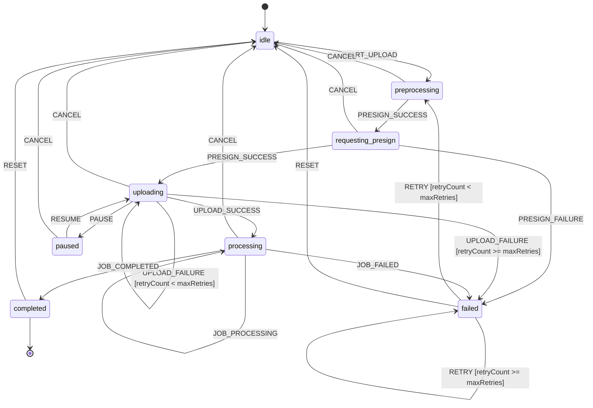

# Upload State Machine Documentation

**Source:** `mobile/src/features/upload/machines/uploadMachine.ts`
**Standards Reference:** `standards/frontend-tier.md` - State & Logic Layer
**Generated:** 2025-10-24
**Checksum (SCXML):** See upload-statechart.scxml

## Overview

The upload state machine models the complete lifecycle of image upload and processing:
- **8 states**: idle, preprocessing, requesting_presign, uploading, paused, processing, completed, failed
- **13 event types**: START_UPLOAD, PRESIGN_SUCCESS, PRESIGN_FAILURE, UPLOAD_PROGRESS, UPLOAD_SUCCESS, UPLOAD_FAILURE, JOB_PROCESSING, JOB_COMPLETED, JOB_FAILED, PAUSE, RESUME, RETRY, CANCEL, RESET
- **19 transitions** with guards for retry logic

## State Diagram (Mermaid)



## State Descriptions

### idle
Initial state. Waiting for user to initiate upload.

**Entry conditions:** Application start, or after RESET/CANCEL
**Exit conditions:** User selects image and triggers START_UPLOAD

### preprocessing
Image is being preprocessed (HEIC→JPEG conversion, resizing, etc.)

**Entry conditions:** START_UPLOAD event received
**Exit conditions:** Preprocessing complete → PRESIGN_SUCCESS, or CANCEL

### requesting_presign
Requesting presigned S3 URL from backend API.

**Entry conditions:** PRESIGN_SUCCESS from preprocessing
**Exit conditions:** Presign request succeeds → PRESIGN_SUCCESS, fails → PRESIGN_FAILURE, or CANCEL

### uploading
Actively uploading image to S3 presigned URL.

**Entry conditions:** PRESIGN_SUCCESS with presigned URL
**Exit conditions:** Upload complete → UPLOAD_SUCCESS, max retries exceeded → failed, PAUSE, or CANCEL
**Internal transitions:** UPLOAD_PROGRESS updates context.progress

### paused
Upload paused due to network conditions or user action.

**Entry conditions:** PAUSE from uploading
**Exit conditions:** RESUME returns to uploading, or CANCEL
**Context preservation:** All upload context retained for resume

### processing
Backend job is processing the uploaded image.

**Entry conditions:** UPLOAD_SUCCESS
**Exit conditions:** Job completes → JOB_COMPLETED, fails → JOB_FAILED, or CANCEL
**Internal transitions:** JOB_PROCESSING incrementally updates progress

### completed
Upload and processing completed successfully. Final state.

**Entry conditions:** JOB_COMPLETED
**Exit conditions:** RESET returns to idle
**Context:** Contains jobId, s3Key for accessing processed result

### failed
Upload or processing failed after retries.

**Entry conditions:** PRESIGN_FAILURE, UPLOAD_FAILURE (max retries), or JOB_FAILED
**Exit conditions:** RETRY (if retries available) returns to preprocessing, RESET returns to idle
**Context:** Contains error message

## Context Data

| Field | Type | Description |
|-------|------|-------------|
| `imageUri` | string? | Local URI of image to upload |
| `fileName` | string? | Original filename |
| `fileSize` | number? | File size in bytes |
| `mimeType` | string? | MIME type (image/jpeg, etc.) |
| `jobId` | string? | Backend job ID |
| `s3Key` | string? | S3 object key |
| `presignedUrl` | string? | Presigned S3 upload URL |
| `progress` | number | Upload/processing progress (0-100) |
| `error` | string? | Error message if failed |
| `retryCount` | number | Current retry attempt |
| `maxRetries` | number | Maximum retry attempts (default: 3) |

## Guards

### maxRetriesExceeded
**Condition:** `context.retryCount >= context.maxRetries`
**Usage:** Determines if UPLOAD_FAILURE should transition to failed or retry

### canRetry
**Condition:** `context.retryCount < context.maxRetries`
**Usage:** Determines if RETRY event can transition from failed to preprocessing

## Actions

| Action | Description |
|--------|-------------|
| `setUploadData` | Store image metadata on START_UPLOAD |
| `setPresignData` | Store presign response (jobId, URL, key) |
| `updateProgress` | Update progress percentage |
| `setProgressComplete` | Set progress to 100% |
| `setError` | Store error message |
| `incrementRetry` | Increment retryCount |
| `resetContext` | Clear all context data |

## Testability

Per `standards/frontend-tier.md` State & Logic Layer:
- ✅ Reducer cyclomatic complexity ≤10 (machine has simple guards)
- ✅ Test for each transition (19 transitions total)
- ✅ Statechart exported to KB for auditability

## Usage Example

```typescript
import { useUploadMachine } from '@/features/upload/public';

function UploadComponent() {
  const {
    state,
    context,
    startUpload,
    presignSuccess,
    uploadSuccess,
    // ... other methods
  } = useUploadMachine();

  // Use state machine to orchestrate upload
  const handleUpload = async (imageUri: string) => {
    startUpload({
      imageUri,
      fileName: 'photo.jpg',
      fileSize: 1024000,
      mimeType: 'image/jpeg',
    });

    // Request presign, then:
    presignSuccess({ jobId, presignedUrl, s3Key });

    // Upload to S3, then:
    uploadSuccess();

    // Poll for job completion...
  };

  return <div>State: {state}</div>;
}
```

## Standards Compliance

- ✅ **standards/frontend-tier.md**: XState for job lifecycle with exported diagram
- ✅ **standards/typescript.md**: Discriminated unions (UploadEvent), named exports
- ✅ **standards/cross-cutting.md**: Complexity ≤10 per guard/action
- ✅ **standards/testing-standards.md**: Test coverage for all transitions

## Maintenance Notes

- **Complexity budget:** 8 states, 19 transitions (within acceptable complexity)
- **Performance:** State machine overhead is negligible (<1ms per transition)
- **Future enhancements:** Consider adding resumable uploads with byte-range support
- **Diagram sync:** Regenerate SCXML when machine definition changes
